# Relacionamentos Entre Classes 🪄

As classes em um sistema Orientado a Objetos raramente trabalham sozinhas. Para construir sistemas mais complexos e interessantes, elas precisam se comunicar e se relacionar. 

Neste material, veremos os tipos fundamentais de relacionamentos estruturais e comportamentais entre classes: **Associação**, **Agregação**, **Composição** e **Dependência**.

## Associação

A ideia principal de um relacionamento de **Associação** é representar um objeto que "usa" ou "interage com" outro.

O Relacionamento de Associação ainda pode ser subdivido em:
* **Plana**: representa uma relação estrutural onde as classes possuem a mesma importância. Uma linha ligando duas classes representa graficamente essa relação. 

* **Agregação**: representa a estrutura todo-parte. Ela é representada por uma linha ligando as duas classes da relação e a presença de um *símbolo diamante* (losango). Esse losango é colocado na conexão entre a linha e a classe que é considerada a mais importante da relação (o "dono").
Além disso, esse losango pode ser representado apenas como contorno ou preenchido, o que faz representar duas formas de relacionamento distintas:
   - Se estiver apenas contornado, tem-se Agregação Simples, ou simplesmente **Agregação**.
   - Se estiver preenchido, têm-se Agregação por Composição, ou simplesmente **Composição**.

Neste capítulo vamos explorar os **tipos de relacionamento entre classes** em Java — usando o universo de **RPG** como pano de fundo. 

---

## 1) Associação — “usa um”

Associação indica que um objeto **usa** outro, sem relação de propriedade estrutural forte. Os ciclos de vida são **independentes**.

### Diagrama simples (A usa B)

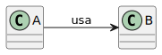

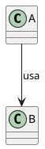
### Diagrama no contexto RPG (Mago usa Magia)

Um **Mago** pode **lançar** uma **Magia**, mas ele não “possui” essa magia permanentemente.  
A `Magia` existe de forma independente do `Mago`.

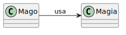

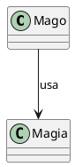

### Código Java

```java
class Magia {
    private String nome;

    public Magia(String nome) {
        this.nome = nome;
    }

    public void executar() {
        System.out.println("A magia " + this.nome + " explode no ar!");
    }
}

class Mago {
    // A associação ocorre aqui: o Mago recebe a Magia para interagir com ela
    public void lancar(Magia magia) {
        System.out.println("Mago prepara o feitiço...");
        magia.executar();
    }
}

public class Main {
    public static void main(String[] args) {
        Mago gandalf = new Mago();
        Magia bolaDeFogo = new Magia("Bola de Fogo");
        
        gandalf.lancar(bolaDeFogo);
    }
}
```
## 2) Agregação — “tem um”

Na agregação, o **todo** mantém uma **referência** para a **parte**, mas o ciclo de vida da parte **não depende** do todo. Se o todo “deixar de existir”, a parte pode continuar existindo no programa.

### Diagrama simples (A o-- B)

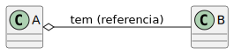

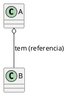

### Exemplo de RPG:
Um Mago "tem um" Item (como um cajado ou amuleto). O Mago usa o Item para melhorar suas habilidades. No entanto, se o Mago for derrotado, o Item pode "dropar no chão" — ele continua existindo na memória independentemente do Mago. O Item pode até ser equipado por outro personagem.

####  Diagrama UML:
Uma linha sólida com um diamante vazio do lado do "todo" (o dono).

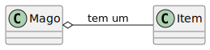

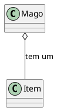

### **Código Java:**
O `Mago` armazena o `Item` como um atributo. Ele não é responsável por instanciar o `Item` — ele apenas o "equipa" (recebe o objeto já criado de fora).

```java
class Item {
    public int bonusMagico;
    public String nomeItem;
    
    public Item(String nome, int bonus) {
        this.nomeItem = nome;
        this.bonusMagico = bonus;
    }

    public void brilhar() {
        System.out.println(nomeItem + " brilha com poder!");
    }
}

class Mago {
    private Item itemEquipado; // Atributo de Agregação

    public Mago() {
        this.itemEquipado = null; // Começa sem item
    }

    // O Mago recebe o item de uma fonte externa
    public void equiparItem(Item item) {
        this.itemEquipado = item;
        if(item != null) {
            System.out.println("Mago equipou o " + item.nomeItem + ".");
        } else {
            System.out.println("Mago desequipou o item.");
        }
    }
    
    public void lancarMagiaForte() {
        int poderBase = 10;
        if (itemEquipado != null) {
            itemEquipado.brilhar();
            int poderTotal = poderBase + itemEquipado.bonusMagico;
            System.out.println("Mago lanca magia com poder " + poderTotal + "!");
        } else {
            System.out.println("Mago lanca magia com poder " + poderBase + ".");
        }
    }
}

public class Main {
    public static void main(String[] args) {
        // Os itens são instanciados e existem FORA do Mago
        Item cajado = new Item("Cajado de Fogo", 5);
        Item amuleto = new Item("Amuleto de Água", 3);
        
        Mago m = new Mago();
        m.lancarMagiaForte(); // Lança sem item
        
        m.equiparItem(cajado); // Equipa o cajado
        m.lancarMagiaForte(); // Lança com o cajado
        
        // O Mago é "destruído" (perde a referência, será limpo pelo Garbage Collector)
        m = null; 
        System.out.println("--- Mago foi derrotado ---");
        
        // ... mas o item continua existindo tranquilamente na memória!
        System.out.println("O item " + cajado.nomeItem + " ainda está no chão, pronto para outro uso.");
    }
}
```

---

## 3) Composição — "é parte de"

A **Composição** é a forma mais forte de posse. É um relacionamento "é parte de" ou "é composto por".

Ela também é um "tem um", mas com uma regra crucial: o ciclo de vida da "parte" é **totalmente controlado** pelo "todo". Se o "todo" deixa de existir, a "parte" também desaparece. A "parte" não faz sentido e não existe sem o "todo".

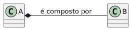

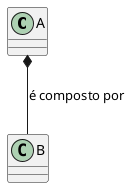

**Exemplo de RPG:**
Um `Mago` "é composto por" um `InventarioInterno`. O `InventarioInterno` de um Mago específico não faz sentido existir sem aquele `Mago`. Quando o `Mago` é criado, seu `InventarioInterno` é instanciado internamente. Quando o `Mago` some, o `InventarioInterno` some junto.

**Diagrama UML:**
Uma linha sólida com um **diamante preenchido** do lado do "todo".

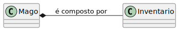

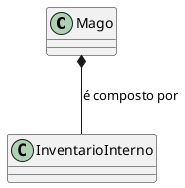
**Código Java:**
O `InventarioInterno` é instanciado **dentro do construtor** do `Mago`. Assim, garantimos que ele só nasce quando o Mago nasce e nunca é repassado para fora.

```java
class InventarioInterno {
    private int capacidade;
    
    public InventarioInterno(int capacidade) {
        this.capacidade = capacidade;
        System.out.println("(Inventário interno criado com capacidade " + capacidade + ")");
    }
    
    public void guardar(String item) {
        System.out.println(item + " foi guardado no inventário.");
    }
}

class Mago {
    private String nome;
    private InventarioInterno inventario; // Composição

    public Mago(String nome) {
        this.nome = nome;
        // A regra de ouro da Composição: O TODO cria a PARTE
        this.inventario = new InventarioInterno(10);
        System.out.println("Mago " + this.nome + " foi criado completamente.");
    }
    
    public void pegarLoot(String item) {
        this.inventario.guardar(item);
    }
}

public class Main {
    public static void main(String[] args) {
        System.out.println("--- Criando Mago ---");
        Mago g = new Mago("Gandalf");
        g.pegarLoot("Poção de Vida");
        
        System.out.println("--- Fim do Jogo ---");
        // Se 'g' se tornar null, o InventarioInterno também perderá sua única 
        // referência e será destruído pelo Garbage Collector junto com o Mago.
        g = null; 
    }
}
```
---

## 4) Estudo de Caso: Druida e Familiar (Associação vs. Composição)

O relacionamento entre **Druida** e **Familiar** pode ser modelado de formas diferentes, dependendo das regras do seu jogo:

* **Associação/Agregação:** o Druida **invoca** um Familiar já instanciado de fora (ciclos de vida independentes).
* **Composição:** o Druida **possui** um FamiliarVinculado que é instanciado pelo próprio Druida (ciclo de vida compartilhado).

### 4.1 Associação Simples / Agregação

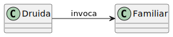

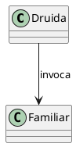

### Código Java (Independência)

```java
class Familiar {
    private String nome;
    public Familiar(String n) { this.nome = n; }
    public void responder() { System.out.println(nome + " atende ao chamado."); }
}

class Druida {
    public void invocar(Familiar f) {
        if (f != null) {
            System.out.println("Druida entoa um canto antigo...");
            f.responder();
        }
    }
}

// Main
// Familiar familiar = new Familiar("Lobo das Brumas");
// Druida druida = new Druida();
// druida.invocar(familiar);
```

### 4.2 Composição

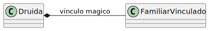

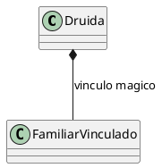

### Código Java (Composição - Vida Compartilhada)

```java
class FamiliarVinculado {
    public FamiliarVinculado() { System.out.println("Um vínculo mágico é formado na alma."); }
}

class Druida {
    private FamiliarVinculado familiar; // composição
    
    public Druida() {
        System.out.println("Druida desperta para a natureza.");
        // O Druida cria o próprio familiar, suas vidas estão atreladas
        this.familiar = new FamiliarVinculado(); 
    }
}
// Main
// Druida druida = new Druida();
// Se o Druida for coletado pelo Garbage Collector, o FamiliarVinculado também será.
```
---

## 5) Comparativo rápido

| Relação    |  Diagrama | Frase mental | Ciclo de vida | Exemplo                      |
| ---------- | --------: | ------------ | ------------- | ---------------------------- |
| Associação | `A --> B` | usa          | Independente  | Mago usa Magia               |
| Agregação  | `A o-- B` | tem (ref.)   | Separado      | Mago equipa Item             |
| Composição | `A *-- B` | é parte de   | Compartilhado | Mago contém Inventario       |

> Em todos os casos acima, tratam-se de **tipos de Associação**. A diferença está no **nível de posse/vida** do objeto “parte”.

---

## 6) Dependência — “usa temporariamente”

A **dependência** é o relacionamento **mais fraco** entre classes.
Ela indica que uma classe **usa outra de forma transitória**, **sem armazená-la como atributo**.
É uma relação **temporária**, geralmente por meio de parâmetros de método, tipos de retorno ou variáveis locais dentro de um método.

Em UML, é representada por uma **seta tracejada (`..>`)**, indicando que uma mudança na classe fornecedora pode afetar a classe cliente.

---

### Diagrama UML

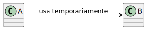

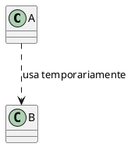
---

## Exemplo 1 — Mago e Feiticeiro

Um **Mago** pode pedir ajuda a um **Feiticeiro** para identificar um artefato mágico.
O Mago **não possui** um Feiticeiro como atributo da classe; ele apenas **depende temporariamente** dele para realizar uma tarefa específica.

### Diagrama UML 

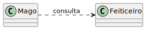

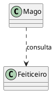

### Código Java

```java
class Feiticeiro {
    public void identificarArtefato(String nome) {
        System.out.println("O Feiticeiro analisa o artefato '" + nome + "' com olhar sábio.");
    }
}

class Mago {
    // O Mago não tem um atributo 'Feiticeiro'. Ele apenas o recebe para este método.
    public void investigarArtefato(Feiticeiro f, String nome) {
        System.out.println("O Mago busca a ajuda de um Feiticeiro...");
        f.identificarArtefato(nome);
    }
}

public class Main {
    public static void main(String[] args) {
        Feiticeiro feiticeiro = new Feiticeiro();
        Mago mago = new Mago();
        
        mago.investigarArtefato(feiticeiro, "Amuleto do Caos");
    }
}
```

---

## Exemplo 2 — Alquimista e Ingrediente

O **Alquimista** utiliza um **Ingrediente** apenas durante o preparo de uma poção.
Após o método terminar, o ingrediente não fica salvo no Alquimista.

### Diagrama UML (Dependência)

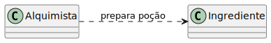

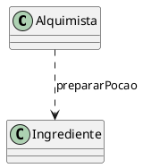
### Código Java

```java
class Ingrediente {
    public String nome;
    public Ingrediente(String n) { this.nome = n; }
}

class Alquimista {
    // Dependência transitória
    public void prepararPocao(Ingrediente ing) {
        System.out.println("Misturando " + ing.nome + " no caldeirão para a poção...");
    }
}

public class Main {
    public static void main(String[] args) {
        Ingrediente ingrediente = new Ingrediente("Raiz de Mandrágora");
        Alquimista alquimista = new Alquimista();
        
        alquimista.prepararPocao(ingrediente);
    }
}
```


