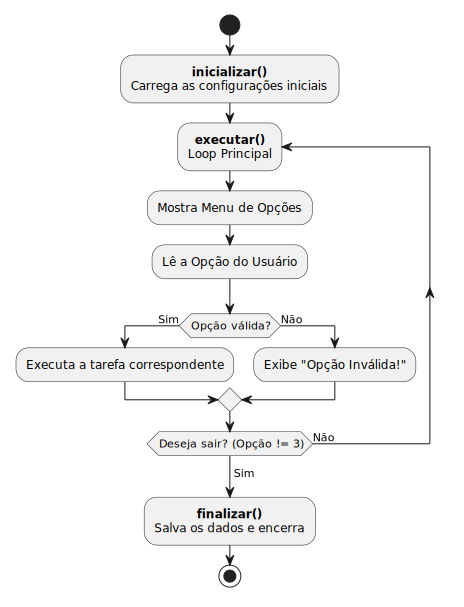
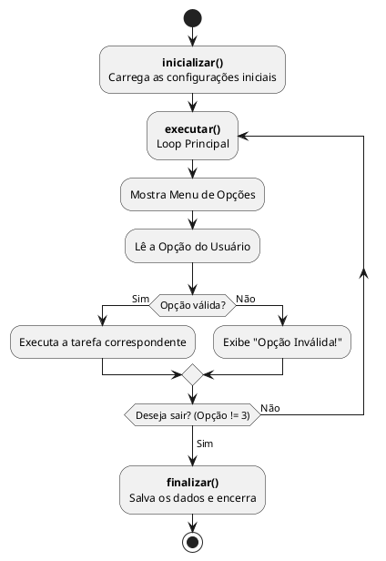

# Estrutura Base de uma Aplicação em Java 🏗️

Até o momento, nossos programas costumavam executar de cima para baixo: declarávamos variáveis, fazíamos alguns cálculos ou testes, imprimíamos um resultado na tela e o programa acabava. 

No entanto, sistemas reais (como um caixa eletrônico, um jogo ou um sistema de cadastro) raramente funcionam assim. Eles ficam "rodando" e aguardando nossas ações até decidirmos que é hora de parar. 

Para organizar esse comportamento, precisamos estabelecer um **Ciclo de Vida da Aplicação**. Neste material, vamos explorar uma estrutura clássica e modular de uma classe gerenciadora (o nosso `Main.java`), que servirá como um "esqueleto" para nossos projetos futuros.

---

## 1) O Ciclo de Vida da Aplicação

Nossa classe `Main` atuará como a grande maestrina do nosso programa. Para não deixar o código bagunçado e gigante dentro de um único bloco, dividimos o fluxo de execução em três fases distintas:

1. **Inicialização:** Prepara o terreno. Carrega dados, instancia os objetos principais e configura o que for necessário antes do usuário começar a interagir.
2. **Execução (Loop Principal):** É o coração do programa. Mantém o sistema rodando, exibindo um menu de opções, capturando a escolha do usuário e executando tarefas até que a opção de "Sair" seja escolhida.
3. **Finalização:** Acontece quando o loop principal é quebrado. Serve para salvar dados em arquivos, fechar conexões, limpar a memória e dar tchau.

### Diagrama de Fluxo



<!--

-->

---

## 2) Dissecando o Código (Main.java)

Vamos entender como essa lógica se traduz no nosso código Java passo a passo.

### Atributos da Classe
Assim como outras classes que estamos aprendendo a modelar, nossa classe gerenciadora pode ter seus próprios atributos. 

```java
public class Main {  
    // Atributos 
    private static Scanner input;
    // ...
```
> **Nota sobre o `static`:** Como nosso método `main` é estático (pertence à classe e não a uma instância específica), todos os métodos e atributos globais que ele chamar diretamente dentro desta mesma classe também precisam ser `static`.

### O Entry Point (Ponto de Entrada)
A função do método `main` agora é apenas **delegar** tarefas. Veja como ele fica limpo e legível. Qualquer pessoa que bater o olho sabe exatamente quais são as etapas do seu programa.

```java
public static void main(String[] args) {
    inicializar();
    executar();
    finalizar();
}
```

### Fase de Inicialização
Por enquanto, nossa inicialização apenas imprime uma mensagem. Futuramente, aqui você criará seus arrays, instanciará os objetos principais (como `Banco`, `Personagem`, `Inventario`) ou fará a leitura de um arquivo de salvamento.

```java
private static void inicializar() {
    System.out.println("Iniciando o programa....");
}
```

### Fase de Execução (O Loop Principal)
O método `executar()` mantém o programa vivo usando a estrutura de repetição `while`. Ele cria um pequeno menu interativo no terminal.

```java
private static void executar() {
    int opcao = 0;
    while (opcao != 3) {
        // 1. Mostrar as opções
        System.out.println("----- Menu de Opcoes -------");
        System.out.println("1 - Fazer tarefa 1");
        System.out.println("2 - Fazer tarefa 2");
        System.out.println("3 - Sair do programa");
        System.out.print("Digite a opcao: ");

        // 2. Ler a entrada
        input = new Scanner(System.in);
        opcao = input.nextInt();

        // 3. Redirecionar para a ação correta
        if (opcao == 1){
            System.out.print("Realizando a tarefa 1\n");
            // Aqui, futuramente, chamaremos outro método ou a ação de um objeto.
        }
        else if (opcao == 2){
            System.out.print("Realizando a tarefa 2\n");
        }
        else if (opcao == 3){
            System.out.print("Saindo do programa!\n");
        }
        else {
            System.out.print("Opção Inválida!\n");
        }
    }
}
```

> **Dica:** O uso da estrutura condicional (aqui com `if/else if`) atua como um "roteador". Mais para frente, o conteúdo de cada bloco `if` pode ser substituído pela chamada de um novo método, deixando o código ainda mais organizado!

### Fase de Finalização
Uma vez que o usuário digita `3`, a condição `opcao != 3` do loop `while` se torna falsa e o programa sai do método `executar()`, caindo direto no método `finalizar()`.

```java
private static void finalizar() {
    System.out.println("Finalizando o programa....");
}
```

---

## 🧠 Boas práticas de programação 

1. **Mantenha o `main` enxuto:** O método `main` não deve conter a lógica pesada da sua aplicação. Use-o apenas para inicializar o fluxo.
2. **Modularize suas ações:** Se a "tarefa 1" do seu menu exigir 50 linhas de código, não escreva as 50 linhas dentro do `if (opcao == 1)`. Crie um método privado específico (ex: `private static void realizarTarefa1()`) e chame-o ali.
3. **Use classes para as regras de negócio:** Lembre-se, o `Main.java` serve apenas para gerenciar o menu e a interação com o usuário. A "inteligência" do sistema deve ficar nas suas outras classes (aquelas que representam os objetos do seu problema).